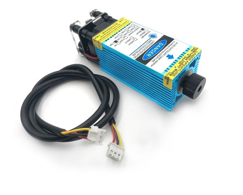

# Maquina CNC

la maquina CNC consiste en una maquina con motores paso a paso por cada eje, en este caso será para 3 Ejes..

Esta posee dos formas de trabajarla con un Motor o con Laser, las dos funcionan para corte y para tallado...

## Motor de 110V (500W)

## Laser de 5.5W opticos

