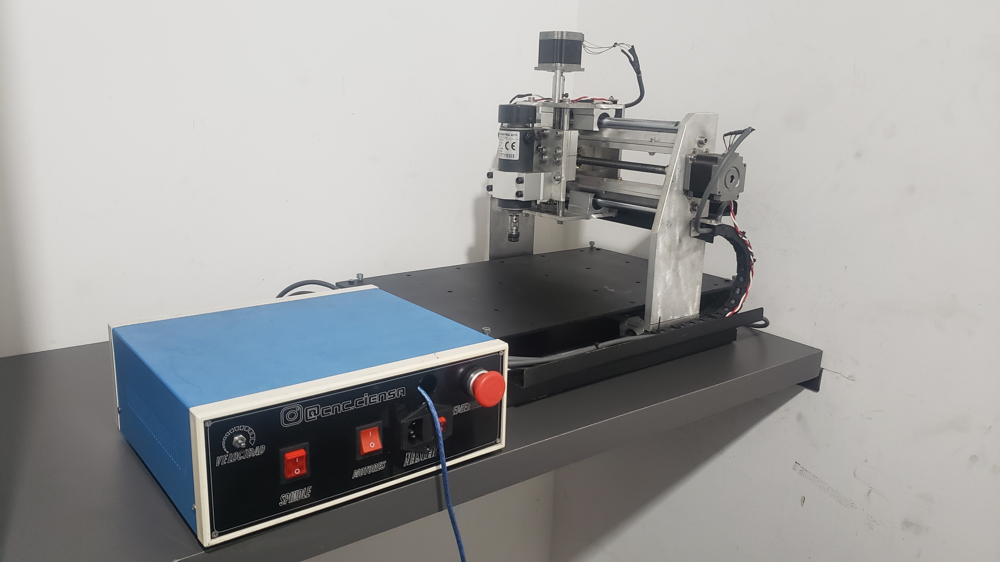
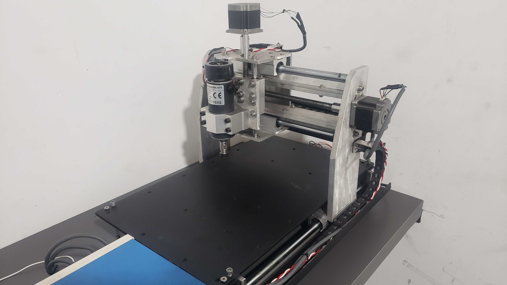
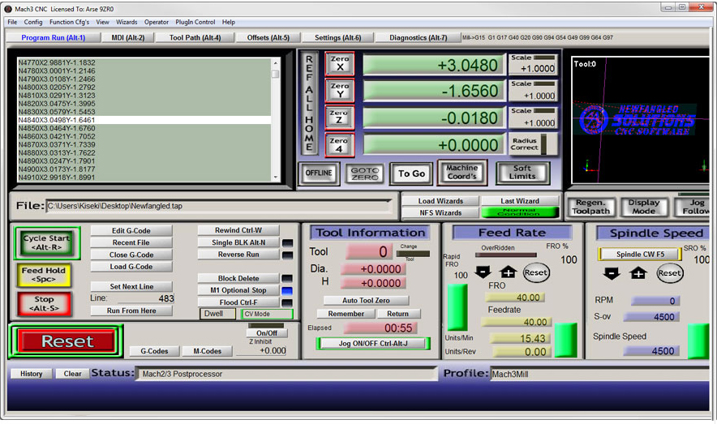

# Maquinado CNC para PCB

## Maquina CNC a usar

## Especificaciones de Fabrica

``AREA DE TRABAJO`` : ``30x20cm``
``VELOCIDAD DE LOS MOTORES PASO A PASO`` : 
``MATERIAL DE CONSTRUCCION`` : ``ALUMINIO``
``CONTROLADOR`` : ``MACH3`` 
``COMPATIBILIDAD`` : ``MOTOR`` , ``LASER`` 

## Software de Control

Instalador y Crack esta adjuntó en la carpeta #SoftwareMACH3

