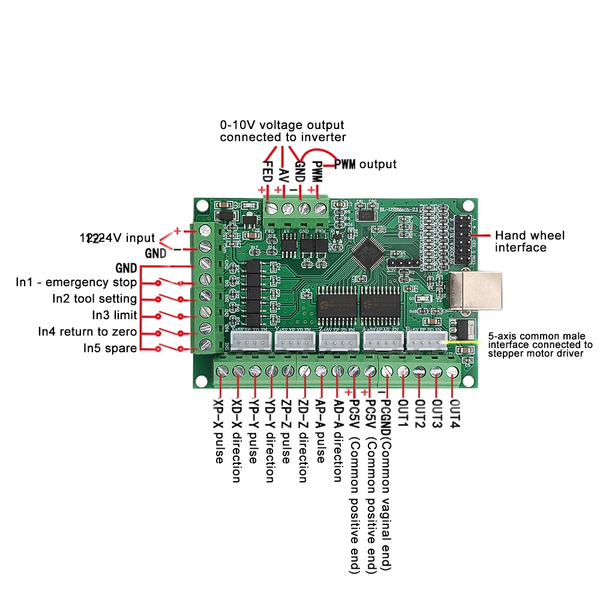

# Controlador BL-UsbMach-V2.1

# Configuración Motor Paso a Paso

## ``Config``/``MotorTuning``

Aquí se configura la ``velocidad``, ``aceleración`` y ``pasos`` de los motores de ``los ejes de la maquina X,Y,Z``.

## PERFIL DE MOVIMIENTO DEL MOTOR DE LOS EJES

este ``perfil dependerá del tipo de motor a usar``, los usados son los que se muestran en el #README

|EJE |Steps per   | Velocity (mm's per min) | Acceleration (mm's/sec/sec)|
|----|------------|-------------------------|-----------------------------|
| X  | 50         | 1000                    | 100                         |
| Y  | 50         | 1000                    | 100                         |
| Z  | 50         | 700                     | 100                         |

## Prueba de Movimiento de los EJES

para probar de forma manual los ejes `X`,`Y` y `Z`. Usaremos el `MACH3` sin abrir ninguna ventana y en la sección ``Program Run Alt-1`` oprimimos el botón del teclado ``TAB``, esto causara que emerja una pestaña a la `izquierda` de la siguiente manera...

# Configuración del Spindle

### ``Config``/``Ports and Pins``/``Motor Outputs``

la ``configuración`` para el uso del ``Spindle`` por medio de ``PWM`` es la siguiente...

### ``Config``/``Ports and Pins``/``Spindle Setup``

Luego ``configuramos`` en control del motor, donde ``tenemos que seleccionar`` lo siguiente en la sección ``Motor Control``

- [x] Use Spindle Motor Output
- [x] PWM Control

``PWMBase Freq.`` : ``10``
``Minimum`` : ``0%``

luego con solo darle clic a ``Spindle CW F5`` generara el ``PWM`` y se comunicara con la fuente regulada por PWM del Spindle...

### Conexión Física

``NOTA``: se debe alimentar ``el controlador MACH3`` con ``12`` o ``24V`` en la siguiente ``bornera``...

# Configuración del sensor de altura Z cero

El sensor de altura consiste en la `detección de continuidad` entre `una entrada del controlador` (`int2`) y `tierra` (`GND`), para la `configuración` en el software `MACH3` es la siguiente...

### ``Config``/``Ports and Pins``/``Input Signals``

la fila `Probe` nos indica `la configuración del sensor de altura` la habilitamos como se muestra a continuación...

| signal | Enabled | Port # | Pin Number | Active Low | Emulated | Hotkey |
|-------|----------|-------|-------------|-------------|---------|-------------|
| Probe | **`x`**       |  1    |  11         |    **`x`**        |     -   |    0        |

