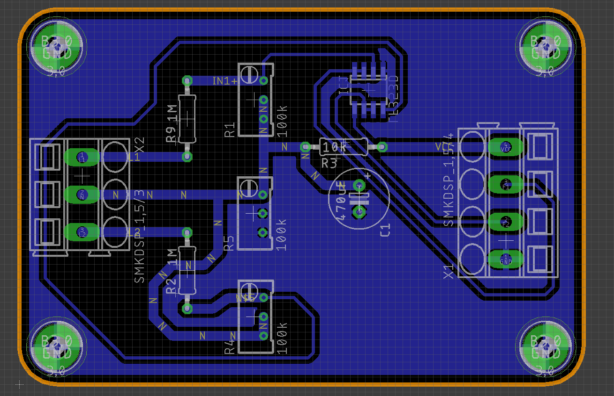

# Medidor de Tensión AC

Este Modulo de medición consiste en una medición de la onda de tensión de la red publica que oscila a un valor RMS de `110V`, por consiguiente, el medidor debe soportar tensiones de `sqrt(2)x110` que es igual a mas o menos `170V`…

## Lista de Componentes Electrónicos

## Esquemático

[Schematics.pdf](img/Schematics_MedidorDeTensionAC.pdf)

## Diseño de la PCB

## Vista por EAGLE

## Créditos
#St3v3n-4n4

