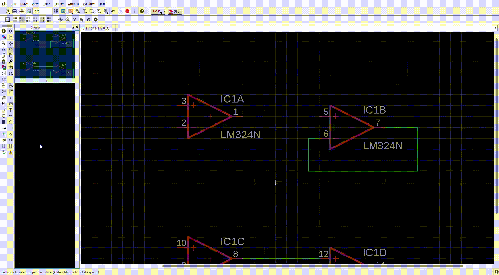
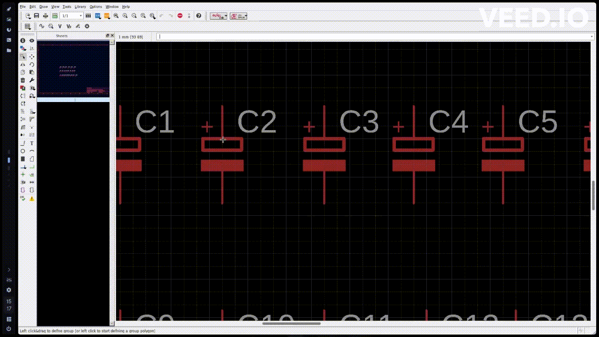

# NOTAS (Configuración Básicas, Atajos de Teclado, Move, Rotate, Net)

## 1. Configuración de Rutas de Directorios

En el `Control Panel` podemos observar en la barra de botones superior izquierda el botón `Options` el cual al abrirlo nos mostrara las siguientes opciones...

la opción `Directories...`  nos abrirá una ventana para poder configurar las direcciones de los directorios de proyectos, entre otras cosas, como se muestra a continuación...

## 2. Panel `Schematic`

la configuración de fondo negro se usa en la siguiente ruta de la barra de botones superior izquierda

-----------------
### 2.1 Configuración de Apariencia
#### 2.1.1 FONDO NEGRO EN EL ESPACIO DE TRABAJO
~~~
Options/User Interce...
~~~

En la sección de `shematic`, podemos pasar de la opción por defecto que es `white` a -> `black`

#### 2.1.2 MALLA EN EL ESPACIO DE TRABAJO

Para `crear la malla gris `que se muestra en la figura anterior,  nos dirigimos a la tercera barra de botones y seleccionamos el siguiente botón…

luego nos abrirá la siguiente ventana...

Aquí podemos `configurar el tamaño` y `las unidades` que usaremos para crear la malla

-----------------
### 2.2 Listado de Componentes (ADD)

Para acceder a la ventana `ADD`, que es el panel de componentes a poder usar, este se encuentra en la esquina superior izquierda, con la imagen del siguiente icono...

al oprimirlo nos arrojara el siguiente panel...

aquí podemos buscar todos los componentes a usar en el circuito que diseñemos...

Por ejemplo podemos buscar un chip marca ATMEL como el TINY13 como se muestra a continuación...

podemos observar a la derecha la descripción del componente su `esquemático` y su `modelo en PCB`, como también una descripción del componente.

También por `ejemplo` si conseguimos un componente que posea `esquemático`, `modelo PCB` y `modelo 3D`, podemos contemplarlo en el panel derecho de `ADD`, en la descripción del componente como se muestra a continuación con el `LM324N`.

Para agregar el componente en la mesa de trabajo solo es necesario darle `aceptar` o `doble clic` al componente, este nos mostrara el `esquemático` del mismo en el espacio de trabajo para poderlo colocar...

`NOTA`:  si de alguna forma se quiere cambiar de componente se puede salir del que se selecciono
con el botón `Esc`

`NOTA`: para girar un componente a la hora de colocarlo en el espacio de trabajo se usa el `clic derecho` para `rotarlo` y `clic izquierdo` para `colocarlo`

-----------------
### 2.3 Atajos de Teclado (Assign)

Para poder ir a la configuración de atajos de teclado tenemos que ir a la siguiente dirección…
~~~
Options/Assign...
~~~
Esto nos retornara el siguiente panel de configuración…

Podemos ver que el comando de teclado `F6` funciona para `quitar` y `colocarla` la malla antes configurada...

Para `Configurar un Atajo de teclado nuevo` le damos al botón `New` que nos abrirá el siguiente panel...

De la siguiente forma he configurado el `comando de teclado` `Ctrl+D` para abrir el panel de componentes llamado `ADD`

Entonces ahora podemos abrir el panel `ADD` con `Ctrl+D` y cerrar el panel con `Esc`

La configuración de `atajos de teclado` creada es la siguiente...

-----------------
### 2.4 Mover Componente

Para mover el componente podemos ir al botón `Move` que se muestra a continuación…

o Podemos usar el atajo de teclado ya configurado que es `Ctrl+W` y luego nos dirigimos con el mouse a un `punto de forma de cruz` que esta dentro del `esquemático` del componente y lo movemos como se muestra a continuación... 

-----------------
### 2.5 Rotar Componente

Para Rotar un componente tendremos que ir al botón `Rotate` que se muestra a continuación…

o Podemos usar el atajo de teclado ya configurado que es `Ctrl+R` y luego nos dirigimos con el mouse a un `punto de forma de cruz` que esta dentro del `esquemático` del componente y lo rotamos como se muestra a continuación… 

-----------------
### 2.6 Conectar Componentes

Para Conectar Componentes usamos el botón `Net` que se muestra a continuación…

o Podemos usar el atajo de teclado ya configurado que es `Alt+S` y luego nos dirigimos a los terminales de los componentes al acercarse al terminal del componente nos mostrara un circulo de color verde indicando que ahí es donde se puede usar esta herramienta de conexión, como se muestra a a continuación… 

-----------------
### 2.7 Uso del Mouse para (mover, rotar, seleccionar)

Para poder tener mayor agilidad podemos usar los botones del mouse, para esto hay que seguir los siguientes pasos...

- [ ] `Seleccionamos` el componente en su `cruz` que se encuentra en el `centro` del mismo
- [ ] Con `Clic Izquierdo` y moviéndonos a los lados, estaremos usando el botón `move`
- [ ] Con `Clic Izquierdo + Clic Derecho`  estaremos usando el botón `rotate`
- [ ] Y si soltamos todo volveremos al botón `grups`

