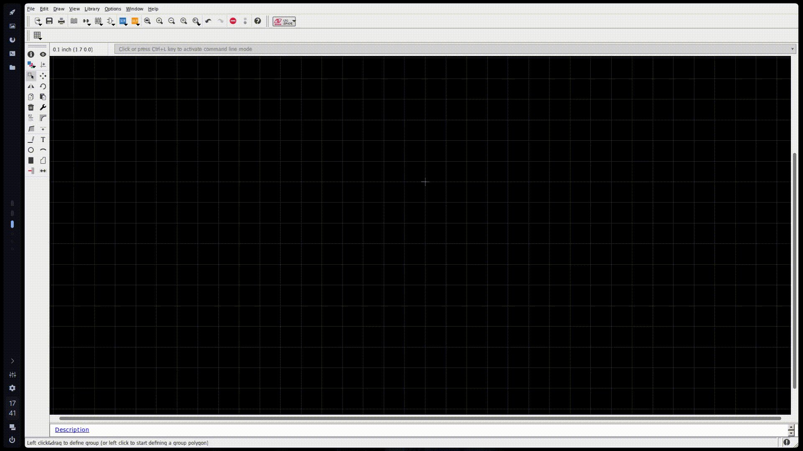
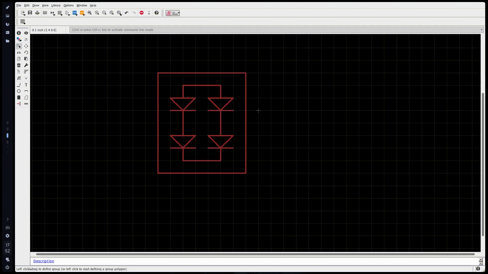

# Notas (Crear Componentes - Diseño Intermedio)

Algunos componentes necesario que tenemos físicamente no estarán en la extensa librería de `eagle` por consiguiente se tienen que crear por cuenta propia...

Para este fin necesitaremos los siguientes programas...

- [ ] EAGLE 9.0.0
- [ ] Blender 2.79
- [ ] Fusion 360
- [ ] Firefox (Navegador favorito)

# Búsqueda de Datasheet

Primero buscamos la referencia del componente con su fabricante la mayoría de estos están en la siguiente pagina llamada alldatasheet...

[alldatasheet](https://www.alldatasheet.es/)

Buscamos el PDF y lo guardaremos en la siguiente dirección de la carpeta del proyecto que hagamos del programa eagle...

`Esto es para que si se quiere enviar el proyecto completo a una persona este tenga toda la información como librerías y documentos que describan por completo el diseño` 

~~~
PROYECTNAME/datasheet/datasheet.pdf
~~~
Luego también podemos buscar el modelado ya hecho en la siguiente pagina llamada 3D CONTENTCENTRAL...

[3D CONTENTCENTRAL](https://www.3dcontentcentral.es/)

Si en esta pagina no se consigue entonces tendremos que moldearlo por cuenta propia con ayuda del componente físico o por el datasheet del fabricante...

### NOTA: PARA MOTIVOS PRÁCTICOS SE CREARA EL COMPONENTE `KBPC5010` (RECTIFICADOR DE PUENTE COMPLETO)

# Creación de la Librería
 para esto nos vamos a la siguiente dirección en el panel de control de EAGLE...

~~~
File/new/Library
~~~
nos abrirá la siguiente ventana...

Aquí tenemos los 3 elementos que compone un componente en EAGLE, que es footprint, 3D Package & Symbol

### Package

aquí es donde se crea la huella del componente

### 3D Package

El modelo en 3D del componente

### Symbol

aquí es donde tendremos el esquemático del componente

En Device es donde estará el nombre del componente ya creado como tal listo para su uso 

# Creación del Symbol del componente electrónico

Para crear el símbolo (symbol), estando en la ventana de creación de librerías buscamos  el botón de symbol que se muestra en la siguiente imagen...

luego nos abrirá una ventana emergente pequeña como se muestra en la siguiente imagen...

Ahora en la sección `New Symbol Name` agregamos el nombre de nuestro componente en este caso es el siguiente
~~~
KBPC5010
~~~
Luego le damos en aceptar, luego de estos nos saldrá una ventana de advertencia indicando que crearemos un nuevo símbolo con el nombre que agregamos anteriormente, como se muestra en la siguiente imagen...

le damos en si y continuamos...

Luego nos abrirá un espacio de trabajo para empezar la creación del símbolo del componente, como se muestra en la siguiente imagen...

como podemos observar nos menciona que agreguemos una descripción al símbolo para esto le damos a `description`  y este nos abrirá la ventana para agregar dicha descripción...

El editor detecta HTML así que se puede organizar bien el texto para que quede bien estructurado...

Luego le damos en aceptar bajamos la barra donde estaba la notificación de description y nos queda el entorno de trabajo como el siguiente...

Ahora buscamos en el datasheet del componente su símbolo o pinout para guiarnos si este no posee dicho símbolo podemos crearlo por cuenta propia...

En este caso no existe tal símbolo o pinout, sin embargo, el componente es un rectificador de onda completa por consiguiente el símbolo debe ser parecido a un puente de diodos...

podemos usar la paleta de herramientas para crear el dibujo del símbolo del componente, sta es la siguiente...

Tenemos...

- Line

- Text

- circle

- Arc

- Rect

- Polygon

- Pin

Al crear el dibujo del símbolo se a creado de la siguiente forma y a quedado como se muestra a continuación...

Ahora le agregaremos los pines al componente, en este caso hay 4 pines 2 de entrada de voltaje AC y dos de voltaje DC de onda pulsan-te, esto quedaría de la siguiente manera...

Luego configuramos los pines dándole clic derecho y abriendo propiedades o nos dirigimos al botón de información que esta en la barra de herramientas, así como se muestra a continuación...

Ahora en propiedades, tenemos las siguientes opciones para configurar los pines, como se muestra en la siguiente imagen...

- `Direction`

Aquí le decimos el tipo de pin, que trabajo va dirigido.

las opciones son: `nc`, `in`, `out`, `io`, `oc`, `pwr`, `pas`, `hiz`, `sup`

- `length`

Aquí le décimos el largo del pin.

las opciones son: `point`, `short`, `middle`, `long`.
- 

- `Function`

Aquí le décimos la función que tendrá, en este caso solo haremos el componente para crear PCB así que no le asignaremos ninguna función...

- `Visible`

Aquí le décimos como queremos que se visualice el pin.

las opciones son: `off`,`pad`, `pin`, `both`.

el componente que se esta creando se configuro de la siguiente manera...

Como podemos ver no tuvimos en cuenta el espacio de los nombre de los pines, sin embargo, haremos unas pequeñas modificaciones al símbolo y el resultado es el siguiente...

Ahora nos falta agregar el nombre y el valor al símbolo del componente, para esto nos vamos a la barra de herramientas y seleccionamos `text` y agregamos los siguientes variables al componente con la siguiente sintaxis...
~~~
>NAME
~~~
Luego buscamos en el `layer` (capas) el numero `95 Names` y lo agregamos cerca al símbolo del componente...

Ahora agregamos el valor, creando el texto sin embargo a este se le agrega lo siguiente...
~~~
>VALUE
~~~
Luego lo cambiamos de capa en el numero `96 Value`

como se muestra a continuación...

Guardamos y listo hemos terminado el símbolo 

Luego nos mostrara la ventana de la librería con el símbolo ya añadido y guardado como se muestra en la siguiente imagen...

# Creación del Package del componente electrónico

Para la creación del package iremos a la barra superior y  

# Modelado 3D en Blender

