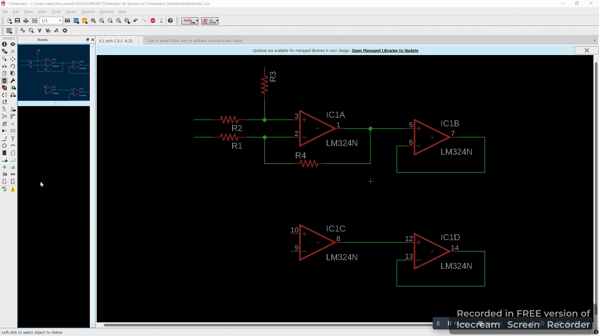

# Notas (Diseño Intermedio)
## **Método de Búsqueda de palabra clave en `ADD`**
Si buscamos por un nombre como `lm324` este dirá que no lo tendrá, sin embargo, si existe solo que este posee un `nombre con mas caracteres`, por consiguiente, se debe hacer una `búsqueda de palabra clave` y no como `palabra exacta`, puesto que si no sabemos como se llama el componente en el programa de forma exacta no lo encontraremos...

Así se observa cuando una búsqueda no la encuentra...

sin embargo, para solucionar este problema podemos agregar `asterisco` en el `inicio` y `final` de la búsqueda así hará una búsqueda de componentes que sean `similares a la palabra clave` que se agrego, de la siguiente forma `*lm324*`, esto se observa a continuación de la siguiente manera y se efectúa con éxito la búsqueda...

------------
## **Búsqueda de componentes básicos (`Resistor`, `Resistencia variable`, `potenciómetro`, `Capacitor`, `Inductor`,`Diodo`,`Bornera`)**

En los parámetros que veremos en la descripción del componente están...

`grid` : `xx mm`

Este dato nos dice `la distancia que hay entre un pin al otro`...

`Diameter` : `xx mm`

Este es mas frecuente de `Capacitores` o Inductores de cilindro...

`Type` : `xxxx`

Este es el `tipo de encapsulado` que posee el componente...

### **Resistor**

La `resistencia` se localiza con la siguiente `dirección` en `ADD` …

~~~
rcl/R-US
~~~

### **Resistencia variable**

La `resistencia variable` se localiza con la siguiente `dirección` en `ADD` …
~~~
rcl/R-TRIMM
~~~

### **Potenciómetro**

El `potenciómetro` se localiza en la siguiente `dirección` en `ADD` …
~~~
pot/3RP/1610N
~~~

### **Capacitor**

El `capacitor electrolítico`  se localiza en la siguiente `dirección` en `ADD` …
~~~
rcl/CPOL-US/CPOL-USE2-5
~~~

El `capacitor Ceramico`  se localiza en la siguiente `dirección` en `ADD` …
~~~
rcl/C-US/C-USE25-025x050
~~~

### **Inductor**

El `inductor` de `forma de resistencia` se localiza en la siguiente `dirección` en `ADD`...
~~~
rcl/L-US/L-US0207/15
~~~

### **Diodo**

El `diodo` se localiza en la siguiente `dirección` en `ADD`...
~~~
diode/1N4446
~~~

### **Bornera (`MKD`)**

Las `borneras` tienen como nombre `MKD` y se localizan en la siguiente `dirección` en `ADD`...
~~~
con-phoenth-508/MKDSN1,5/2-5,08
~~~

---------------------------------------
----------------------------------------
## **Pin Etiqueta**
Para Agregar las etiquetas (`Label`) tenemos que irnos al botón que posee el siguiente icono...

o podemos configurar un `comando de teclado` para activarlo

`NOTA` : si por defecto no se muestra el grafico de etiqueta si no en cambio se muestra solo el nombre de la etiqueta, debemos configurarlo de la siguiente manera...

Oprimiendo `Label` que es el botón de etiqueta, le damos clic derecho a la cruz del nombre de la etiqueta y esto nos desplegará un menú donde iremos al final en `propierties` y nos saldrá un panel de configuración, luego nos dirigimos al `checkbox` que tiene como nombre `Xref` y lo habilitamos luego le damos en aplicar y listo tenemos el grafico de la etiqueta. el proceso mencionado se muestra a continuación...

-------------------------------------------
## **Plantilla de Presentación (`FRAME`)**

Para Agregar un `Frame` tenemos que buscarlo en el panel `ADD` y buscar por el nombre de `frame` esto nos mostrara lo siguiente...

## **Mover Texto enlazado al Componente**
Para poder mover el texto enlazado al componente tendremos que seleccionar el componente en modo selección `group` luego le damos clic derecho y nos vamos a `properties` luego activamos el `CheckBox` y listo, el procedimiento se muestra a continuación...

