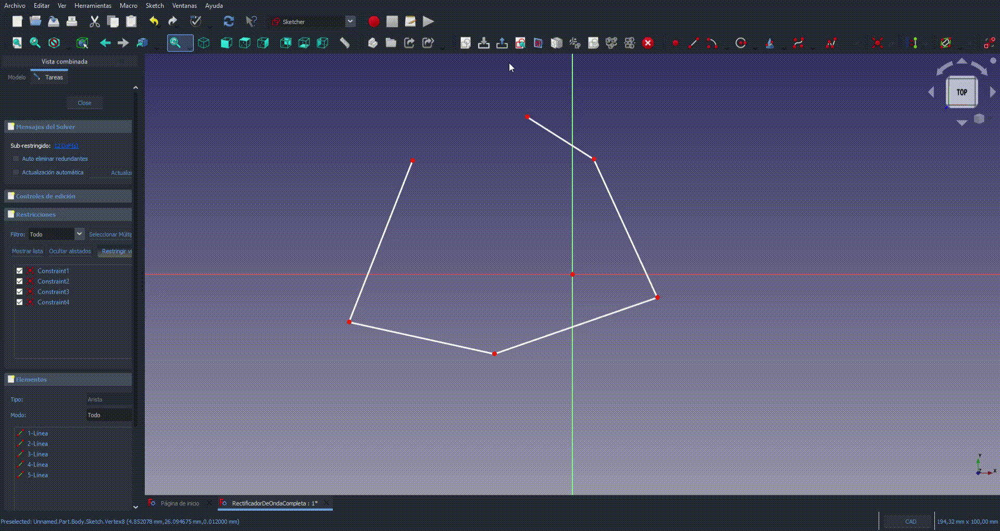

# Comandos de Teclado de Acceso Rapido

Para observar los comandos de acceso rapido nos debemos dirigir a la barra de herramientas superior izquierda en la seccion `Herramientas` luego en `personalizar`... como se muestra en la siguiente imagen...


en la seccion de teclado podemos ver la accion y al lado derecho el comando de telcado y tambien nos da la posibilidad de configurarlo como nostros queramos, como se muestra en la siguiente imagen...


## Comandos de teclado mas usados


```
Ctrl+n
```

```
R
```
Crear Rectangulos en una vista...


```
L
```
Crear una linea en una vista...


```
Shif+L
```
Crear multiples lineas unidas en puntos...


```
C
```
Seleccionando `dos puntos` para crear solo `un punto`  `NOTA`: no es necesario usar `shift` para seleccionar


```
V
```
Coloca fija la linea seleccionada en vertical...


```
H
```
Coloca fija la linea seleccionada en Horizontal...


```
P
```
Coloca dos lineas seleccionadas en paralelo...


```
P
```
Coloca dos lineas con un angulo de 90 grado (perpendicular)


```
Shift+H
```
Redimencionamos una linea horizontal


```
Shift+V
```
Redimencionamos una linea vertical


```
E
```
Al seleccionar dos lineas iguala sus parametros


```
x
```
Recortamos la arista seleccionada...


```
S
```
Selecionando 3 puntos se selecciona para que posean la misma simetria...


```
Shift+C
```
Geometria seleccionada a modo de construccion...


```
Alt+E
```
Comando de teclado para `extruir` el `croquis`, estando en el modo `Part Design`....


```
G
```
Para aliniar un objeto con una linea...
