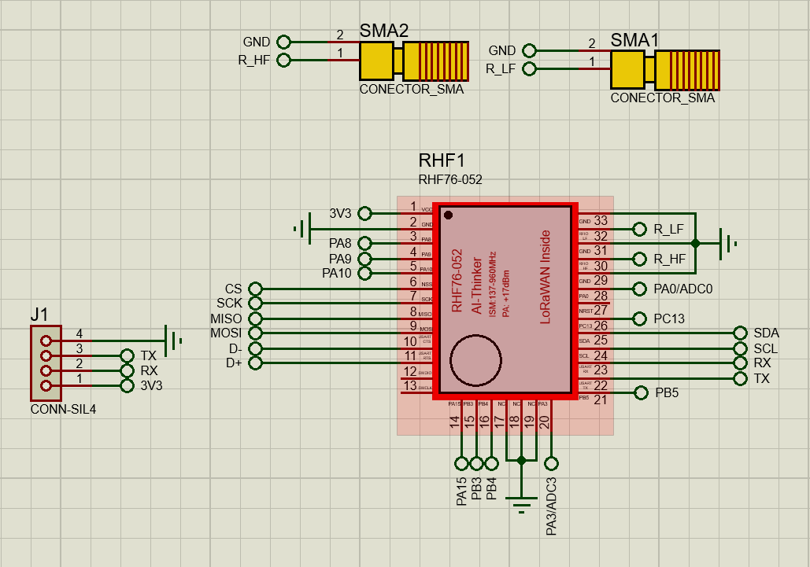
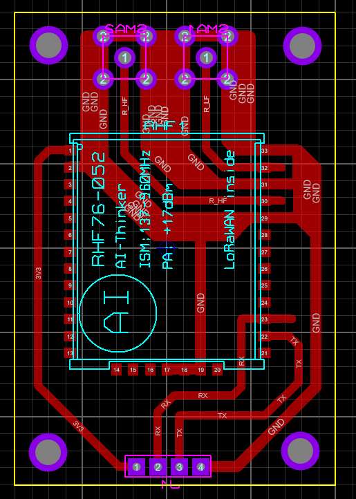
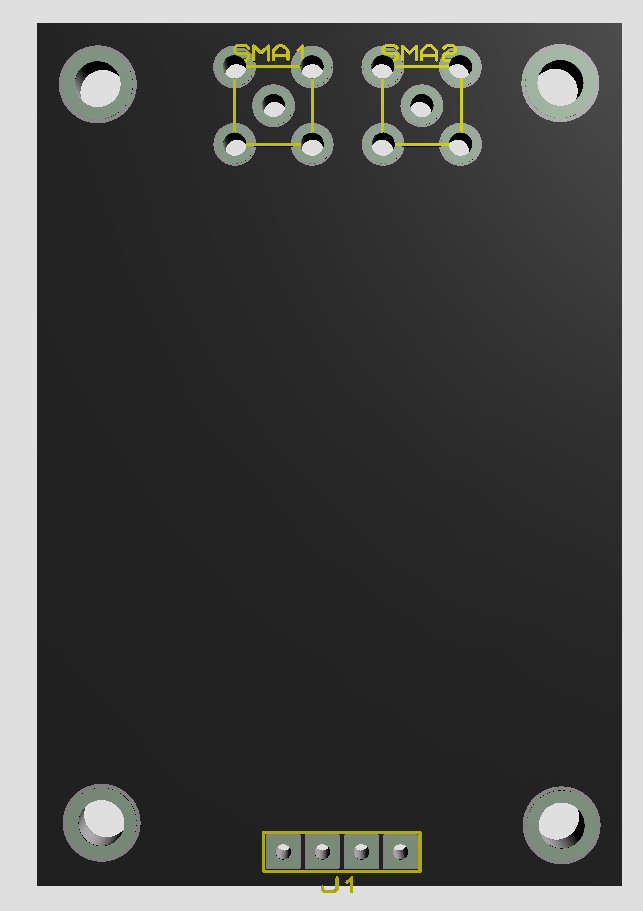
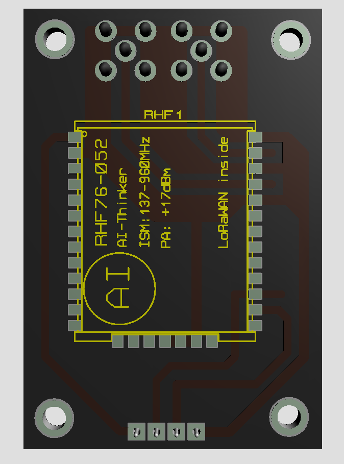

#Hardware 

[Tarjeta de Prueba](../Tarjeta%20de%20Prueba.md)

# Tarjeta de Prueba v1.1

## Esquema Electrónico

## Diseño PCB

## Vista 3D

Vista 3D de la capa Superior del PCB

Vista 3D de la capa inferior del PCB

