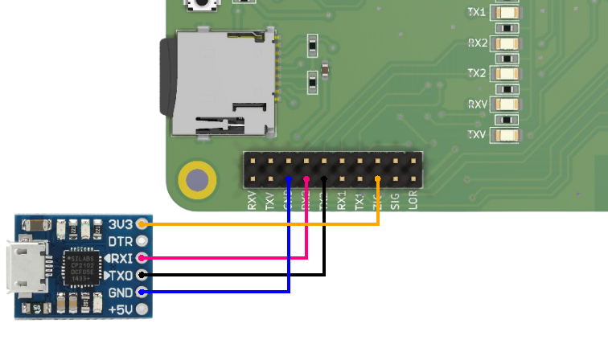
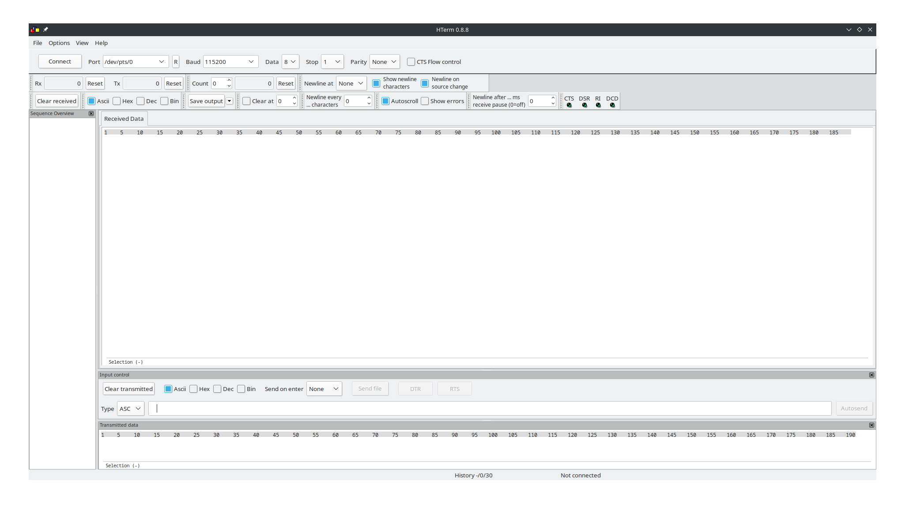
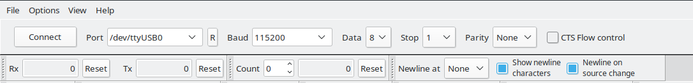
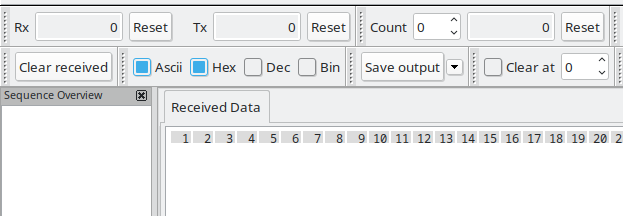
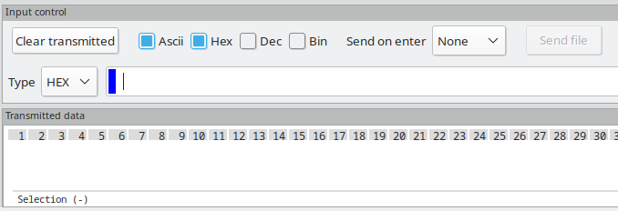

# Modo HEX a Modo AT Zigbee

Cuando se trabaja con módulos RF **Zigbee**, es común encontrar que, por defecto, están configurados en modo de comandos HEX (**Hexadecimal**). Sin embargo, para una experiencia más sencilla y comúnmente utilizada, es recomendable cambiar al modo de comandos AT (**Comandos de Control**).

El modo de **comandos AT** permite interactuar con el módulo Zigbee mediante comandos alfanuméricos más legibles y fáciles de entender. A través de estos comandos, se puede configurar y controlar el módulo de manera intuitiva.

## **Software HTerm**

El software **Hterm** es una herramienta de terminal que facilita **la comunicación en serie** y puede ser ejecutado tanto en **Windows** como en **Linux**. Esta aplicación resulta especialmente útil para simplificar la configuración al modo de comandos AT en **AnaBit**.

Cuando iniciamos el proceso de configuración, es necesario proporcionar comandos en formato HEX (**hexadecimal**). Sin embargo, el monitor serial de Arduino IDE no está diseñado para la comunicación en formato HEX y utilizar la comunicación UART directamente puede resultar complejo de comprender para usuarios principiantes.

En este escenario, el software Hterm se vuelve imprescindible. Al combinarlo con un **módulo conversor de USB a UART**, podemos realizar el cambio de modo de forma sencilla y práctica.

Para la instalación en **Windows**, puedes acceder al siguiente enlace (<a href="https://www.der-hammer.info/pages/terminal.html" target="_blank" class="hljs-tag">Hterm Windows</a>) para descargar el software Hterm. Una vez descargado, sigue las instrucciones de instalación proporcionadas para completar el proceso.

En cuanto a los entornos **Linux**, la instalación de Hterm puede variar según la distribución específica que estés utilizando. A continuación, se detallan los pasos de instalación para **Ubuntu** y **Arch Linux**:

### **Ubuntu**:

* Abre la terminal en Ubuntu.
* Ejecuta el siguiente comando para instalar el software Hterm:

~~~bash
sudo apt-get install hterm
~~~

* Proporciona tu contraseña de administrador cuando se te solicite.
* Espera a que se complete la instalación.
* Una vez finalizada la instalación, podrás ejecutar Hterm desde la terminal utilizando el comando hterm.

### **Arch Linux**:

* Abre la terminal en Arch Linux.
* Utiliza el siguiente comando para instalar Hterm a través del administrador de paquetes `yay`:

~~~bash
yay -S hterm
~~~

* Proporciona tu contraseña de administrador si se te solicita.
* Espera a que se complete la instalación.
* Una vez instalado, podrás ejecutar Hterm desde la terminal utilizando el comando hterm.

## **Conexión del Módulo Conversor USB a UART con AnaBit**

La conexión del **módulo conversor USB a UART** con **AnaBit** es extremadamente sencilla de realizar gracias al diseño de la PCB de AnaBit, que permite un aislamiento completo del módulo con el MCU. Esto significa que puedes utilizar únicamente el módulo que necesites sin interactuar con ningún otro componente de AnaBit, lo que proporciona una configuración segura y práctica.

En la anterior figura se muestra cómo realizar la conexión, por defecto AnaBit posee **puentes en la regleta de pines 10x2**, para realizar dicha conexión se es necesario **quitarlos**. Solo necesitarás conectar los pines **TX2** y **RX2** exactamente como se indica en la serigrafía de la tarjeta. ***No es necesario cruzar los cables con respecto al módulo***, ya que la serigrafía ya indica el nombre del pin que debes conectar. Los nombres en la serigrafía representan el pin de alimentación de cada módulo.

Es importante tener en cuenta que todos los módulos y la tarjeta AnaBit utilizan una alimentación de **3.3V** para su correcto funcionamiento. Asegúrate de proporcionar la alimentación adecuada para evitar cualquier daño en los componentes.

## **Comandos HEX para la conversion a modo de comandos AT**

Para convertir del modo de comandos HEX (**modo por defecto**) al modo de comandos AT, es necesario configurar el programa HTerm correctamente. A continuación se detallan los pasos necesarios para esta configuración:

* Abre el programa HTerm en tu sistema operativo (**Windows o Linux**).

* En la configuración del puerto, selecciona el puerto correspondiente al módulo conversor USB a UART. En Windows, esto puede ser algo como "`COMX`", donde "**X**" representa el número del puerto. En Linux, generalmente se utiliza algo como "`/dev/ttyUSBX`", donde "**X**" también representa el número del puerto, por otro lado es necesario indicar **la velocidad de comunicacion** en baudios el cual el modulo se comunica con `115200`.

* Asegúrate de configurar la **recepción** de datos por `ASCII` y `HEX`. Esto permitirá que HTerm interprete correctamente los datos recibidos. Puedes encontrar esta configuración en la sección de opciones o preferencias del programa. Busca la opción para seleccionar el formato de recepción y elige tanto `ASCII` como `HEX`.

* Configura la **transmisión** de datos para que se envíen en formato `HEX`. Esto asegurará que los comandos que envíes al módulo estén en el formato correcto. Busca la opción correspondiente en la configuración de transmisión y selecciona `HEX`.

Con estas configuraciones, ahora podemos establecer comunicación con el módulo Zigbee. Para cambiar el módulo al modo de comandos AT, simplemente ingresa el siguiente comando en `formato HEX` y el módulo se configurará automáticamente.

~~~HEX
53 03 00 16 16
~~~

retornara si fue exitoso lo siguiente

~~~HEX
55 04 00 16 00 16
~~~

Si deseas verificar que el cambio se ha realizado correctamente, simplemente cambia la configuración del transmisor en HTerm de `HEX` a `ASCII`. Luego, escribe el siguiente comando en `formato AT` y envíalo al módulo.

~~~AT
AT+INFO?
~~~

retornara la informacion de modulo como `tipo de nodo` y la `MAC`

Al cambiar la configuración del **transmisor a ASCII**, te asegurarás de que los comandos que ingreses sean legibles y entendibles. Al enviar el comando AT, podrás obtener una respuesta del módulo Zigbee, lo que te permitirá verificar que estás en modo de comandos AT y que la comunicación se ha establecido correctamente.

Recuerda que es importante seguir las instrucciones y recomendaciones del fabricante del módulo Zigbee en cuanto a los comandos específicos y la configuración necesaria para realizar la transición al modo de comandos AT. Estos comandos pueden variar según el fabricante y el modelo del módulo Zigbee que estés utilizando, por consiguiente se puede consultar el siguiente manual para la configuracion de disño modulo Zigbee ([E180-ZG120A/B V1.0 User Manual](assets/Datasheet/E180-ZG120series_Software_Datasheet_EN_V1.4.pdf))