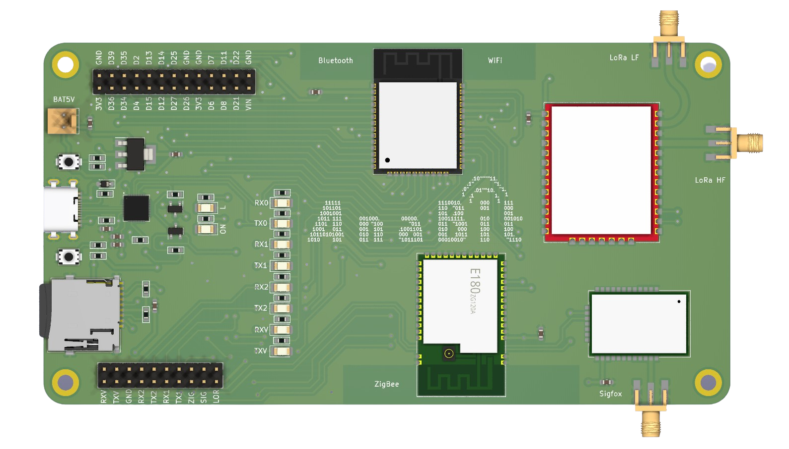

# Wiki de AnaBit

 

La Wiki de **AnaBit** es un recurso que proporciona una amplia gama de información y guías prácticas para aprovechar al máximo esta **tarjeta de desarrollo IoT**. Al explorar la Wiki, encontraras una gran cantidad de contenido útil y relevante que les permitirá utilizar AnaBit en diversos proyectos.

## **Contenido**

**_Introduccion_**

- [Requerimientos](index.md#requerimientos)

**_Especificaciones Técnicas_**

**_`Conexiones y Arquitectura`_**

- [Diagrama Pinout](pinout.md#diagrama-pinout)
- [Tabla GPIO](pinout.md#tabla-gpio)
- [Arquitectura de Hardware](pinout.md#arquitectura-de-hardware)

**_`Datasheet de módulos RF`_**

- [RHF76-052DM (LoRa)](datasheetComponentes.md#rhf76-052dm-lora)
- [SFM11R2D (Sigfox) ](datasheetComponentes.md#sfm11r2d-sigfox)
- [E180ZG120A (Zigbee)](datasheetComponentes.md#e180zg120a-zigbee)
- [ESP32 (WiFi/Bluetooth)](datasheetComponentes.md#esp32-wifibluetooth)

**_Testing y Configuración_**

**_`Modo HEX a Modo AT Zigbee`_**

- [Software HTerm](HEX_AT_Zigbee.md#software-hterm)
- [Conexión del Módulo Conversor USB a UART con AnaBit](HEX_AT_Zigbee.md#conexión-del-módulo-conversor-usb-a-uart-con-anabit)
- [Comandos HEX para la conversion a modo de comandos AT](HEX_AT_Zigbee.md#comandos-hex-para-la-conversion-a-modo-de-comandos-at)

**_`Configuración del IDE de Arduino`_**

- [Configuración de la URL de Gestión de Placas](ConfigIDEArduino.md#configuración-de-la-url-de-gestión-de-placas)
- [Configuración del Gestor de Placas](ConfigIDEArduino.md#configuración-del-gestor-de-placas)
- [Tipo de Placa para la Programación de AnaBit](ConfigIDEArduino.md#tipo-de-placa-para-la-programación-de-anabit)

**_`Modo OTA`_**

- [Programación de la Interfaz OTA en AnaBit](Modo_OTA.md#programación-de-la-interfaz-ota-en-anabit)
- [Verificacion de activacion de la Interfaz OTA en AnaBit](Modo_OTA.md#verificacion-de-activacion-de-la-interfaz-ota-en-anabit)

**_`Testing`_**

- [Test de Pines GPIO](Testing.md#test-de-pines-gpio)
- [Test de Comunicación UART con los Módulos RF](Testing.md#test-de-comunicación-uart-con-los-módulos-rf)
- [Test de Almacenamiento Externo con MicroSD](Testing.md#test-de-almacenamiento-externo-con-microsd)

**_Ejemplos_**

**_`Comunicación con LoRa`_**

- [Red LoRa Punto a Punto con AnaBit](Ejemplo_LoRa.md#red-lora-punto-a-punto-con-anabit)

**_`Comunicación con Zigbee`_**

- [Red Zigbee protocolo Zigbee 3.0](Ejemplo_Zigbee.md#red-zigbee-protocolo-zigbee-30)
- [Configuración del tipo de dispositivo con AnaBit](Ejemplo_Zigbee.md#configuración-del-tipo-de-dispositivo-con-anabit)
- [Ejemplo de proyecto con AnaBit](Ejemplo_Zigbee.md#ejemplo-de-proyecto-con-anabit)

## **Requerimientos**

Asegúrate de cumplir con todos estos requerimientos si deseas aprender a utilizar la tarjeta de desarrollo IoT AnaBit consultando la wiki:

- `Fabricación de la tarjeta`:
  La fabricación de la tarjeta de desarrollo IoT AnaBit requiere establecer una comunicación directa [conmigo](https://github.com/N0c7u4). Si estás interesado en obtener tu **AnaBit**, por favor, contáctame a través de este enlace de correo:     Estoy emocionado por la posibilidad de trabajar juntos en este emocionante proyecto de IoT y espero poder conversar contigo pronto.

- `Computadora con software de Arduino IDE`:
  Instala el software de Arduino IDE en tu computadora. Puedes descargarlo e instalarlo desde el siguiente enlace (<a href="https://docs.arduino.cc/software/ide-v2" target="_blank" class="hljs-tag">Link de Instalacion</a>).

- `Red WiFi local`:
  Asegúrate de contar con una red WiFi local para aprovechar la funcionalidad de configuración OTA (<a href="https://www.analog.com/en/analog-dialogue/articles/over-the-air-ota-updates-in-embedded-microcontroller-applications.html" target="_blank" class="hljs-tag">Over-The-Air</a>) en AnaBit.

Al cumplir con estos requerimientos, podrás aprovechar al máximo la información y guías proporcionadas en la wiki de AnaBit para aprender a utilizar **AnaBiT** de manera efectiva.
