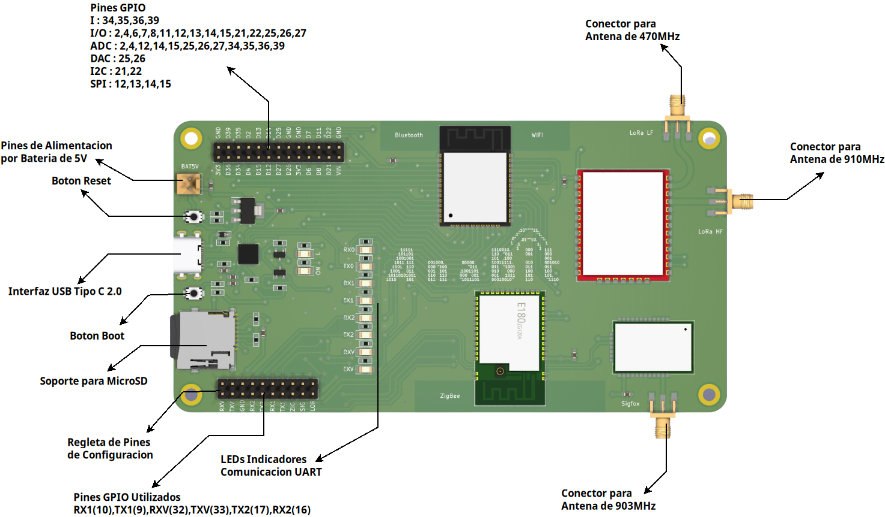

# Conexiones y Arquitectura

## Diagrama Pinout

El diagrama pinout de **AnaBit** muestra claramente los pines numerados y sus respectivas funciones. Por ejemplo, puede incluir pines de alimentación que suministran energía a la tarjeta, pines de entrada/salida que permiten la comunicación con otros dispositivos, pines de conexión para sensores, actuadores u otros periféricos, pines de tierra para establecer una referencia común, entre otros.

## Tabla GPIO

|
Funsion
                       |
N° GPIO
|
N° Pin
 |
N° Pin
 |
N° GPIO
|
Funcion
             |
|-----------------------------------------------|------------------------|------------------------|------------------------|------------------------|-------------------------------------|
|
Alimenatación
                 |
3V3
    |
1
      |
2
      |
GND
    |
Tierra Comun
        |
|
ADC1_0/Pin_I
                  |
36
     |
3
      |
4
      |
39
     |
ADC1_3/Pin_I
        | 
|
ADC1_6/Pin_I
                  |
34
     |
5
      |
6
      |
35
     |
ADC1_7/Pin_I
       |    
|
ADC2_0/Pin_IO/touch0
          |
4
      |
7
      |
8
      |
2
      |
ADC2_2/Pin_IO/touch2
| 
|
ADC2_3/Pin_IO/HSPI_CS/touch3
  |
15
     |
9
      |
10
     |
13
     |
ADC2_4/Pin_IO/HSPI_MOSI/touch4
| 
|
ADC2_5/Pin_IO/HSPI_MISO/touch5
|
12
     |
11
     |
12
     |
14
     |
ADC2_6/Pin_IO/HSPI_CLK/touch6
| 
|
ADC2_7/Pin_IO/touch7
          |
27
     |
13
     |
14
     |
25
     |
ADC2_8/Pin_IO/DAC1
| 
|
ADC2_9/Pin_IO/DAC2
            |
26
     |
15
     |
16
     |
GND
    |
Tierra Comun
|   
|
Alimenatación
                 |
3V3
    |
17
     |
18
     |
GND
    |
Tierra Comun
| 
|
Pin_IO
                        |
6
      |
19
     |
20
     |
7
      |
Pin_IO
| 
|
Pin_IO
                        |
8
      |
21
     |
22
     |
11
     |
Pin_IO
| 
|
I2C_SDA/Pin_IO
                |
21
     |
23
     |
24
     |
22
     |
I2C_SCL/Pin_IO
| 
|
Alimentacion Input
            |
VIN
    |
25
     |
26
     |
GND
    |
Tierra Comun
| 

## Arquitectura de Hardware

